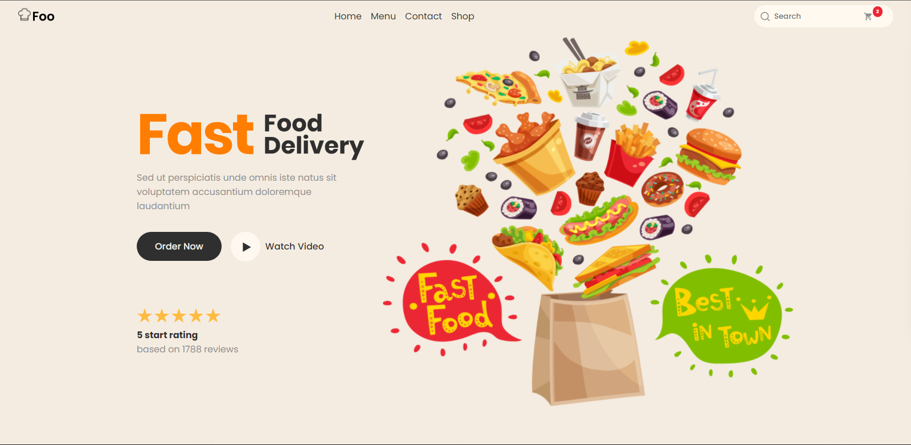

# Foo | Fast Food Delivery

* Essa é uma landing page feita como prática de HTML e CSS, apropriada para navegador mas com responsividade também para o mobile.
* Procurei por soluções de responsividade com meu conhecimento atual.
* O projeto foi criado no Figma.

Link com o projeto base no Figma: https://www.figma.com/file/RFQ5iDMZz5D2DlcPq4RXMG/Food-Delivery-Landing-Page-%F0%9F%8D%95-(Community)-(Community)?node-id=0%3A1

# O resultado foi esse:

